# 並列処理と並行処理

プログラムを高速化する方法として、並行処理と並列処理が存在する。両者は混ざりやすいので区別することが理解の第一歩である。

## 並列処理

英語では`Concurrency`と呼ばれる。物理的に複数のコアが複数の処理を同時に実行すること。タスクに計算量が多い場合にコア数倍に高速化される。

例えば、下記の例では依存関係のないタスクAとタスクBを並列に処理することで、高速化する概念的な例である。

```mermaid
gantt
    title 並列処理
    dateFormat  X
    axisFormat %s

    section コア1
    処理A   :active, a1, 0, 8

    section コア2
    処理B :active, b1, 0, 8
```

```mermaid
gantt
    title 直列な処理
    dateFormat  X
    axisFormat %s

    section コア1
    処理A   :active, a1, 0, 8
    処理B :b1, after a1, 16
```





## 並行処理(≒非同期処理)

英語では`Parallelism`と呼ばれる。1つのコアが複数の処理を同時に実行すること。タスクに外部に依存した待ち時間が多い場合に、CPUのスループットが向上する。今回は扱わない。

# まずは処理速度の向上を体験してみよう

とりあえず早くなることを体験しよう。

## Rayonの導入

Rustでは通常のRayonというクレートを使って並列処理を実行することが多い。

```toml
rayon = "1.12.0"
```

## 関数を並列に実行してみる

### まず普通に書いてみる

```rs
//ただただ重い処理
fn heavy_task(name: &str) {
    println!("start {}", name);

    let mut sum = 0u64;
    for i in 0..1_000_000_00 {
        sum += i;
    }

    println!("end {}: {}", name, sum);
}

fn main() {
    let start = std::time::Instant::now();

    heavy_task("A");
    heavy_task("B");

    println!("time: {:?}", start.elapsed());
}
```

### Rayonを用いて実行してみる

```rs
use rayon::join;

//ただただ重い処理
fn heavy_task(name: &str) {
    println!("start {}", name);

    let mut sum = 0u64;
    for i in 0..1_000_000_00  {
        sum += i;
    }

    println!("end {}: {}", name, sum);
}

fn main() {
    let start = std::time::Instant::now();

    join(
        || heavy_task("A"),
        || heavy_task("B"),
    );

    println!("time: {:?}", start.elapsed());
}

```

### 更に重くしてみよう

```rs
//ただただ重い処理
fn heavy_task(name: &str) {
    println!("start {}", name);

    let mut sum = 0u64;
    for i in 0..1_000_000_00  {
        sum += i;
    }

    println!("end {}: {}", name, sum);
}

fn main() {
    rayon::scope(|s| {
        s.spawn(|_| heavy_task("A"));
        s.spawn(|_| heavy_task("B"));
        s.spawn(|_| heavy_task("C"));
        s.spawn(|_| heavy_task("D"));
    });
}

```

## モンテカルロ法

### まず普通に書いてみる

```rs
use rand::Rng;

fn main() {
    let total = 50_000_000;
    let mut inside = 0;

    let mut rng = rand::thread_rng();

    let start = std::time::Instant::now();

    for _ in 0..total {
        let x: f64 = rng.gen();
        let y: f64 = rng.gen();

        if x * x + y * y <= 1.0 {
            inside += 1;
        }
    }

    let pi = 4.0 * inside as f64 / total as f64;

    println!("π ≈ {}", pi);
    println!("time: {:?}", start.elapsed());
}
```

### Rayonを用いて実行してみる

```rs
use rand::Rng;
use rayon::prelude::*;

fn main() {
    let total = 50_000_000;

    let start = std::time::Instant::now();

    let inside: u64 = (0..total)
        .into_par_iter()
        .map(|_| {
            let mut rng = rand::thread_rng();
            let x: f64 = rng.gen();
            let y: f64 = rng.gen();

            if x * x + y * y <= 1.0 { 1 } else { 0 }
        })
        .sum();

    let pi = 4.0 * inside as f64 / total as f64;

    println!("π ≈ {}", pi);
    println!("time: {:?}", start.elapsed());
}

```

# タスクマネージャーを見てみよう

作成したプログラムを実行し、タスクマネージャーを見てみよう。複数のコアが使われていることを確認しよう。

# 並列処理の制約や注意点

- 順序性が保存されない
- 同時に同じ変数を更新できない(`Mutax`や`Arc`を使用する必要がある)
