# 並列処理と並行処理
プログラムを高速化する方法として、並行処理と並列処理が存在する。両者は混ざりやすいので最初に整理する。

## 並列処理
英語では`Concurrency`と呼ばれる。物理的に複数のコアが複数の処理を同時に実行すること。タスクに計算量が多い場合にコア数倍に高速化される。

例えば、下記の例では依存関係のないタスクAとタスクBを並列に処理することで、高速化する概念的な例である。

```mermaid
gantt
    title 並列処理
    dateFormat  X
    axisFormat %s
    
    section コア1
    処理A   :active, a1, 0, 8
    
    section コア2
    処理B :active, b1, 0, 8
```

```mermaid
gantt
    title 直列な処理
    dateFormat  X
    axisFormat %s

    section コア1
    処理A   :active, a1, 0, 8
    処理B :b1, after a1, 16
```





## 並行処理(≒非同期処理)
英語では`Parallelism`と呼ばれる。1つのコアが複数の処理を同時に実行すること。タスクに外部に依存した待ち時間が多い場合に、CPUのスループットが向上する。今回は扱わない。


# まずは処理速度の向上を体験してみよう
とりあえず早くなることを体験しよう。

## Rayonの導入
Rustでは通常のRayonというクレートを使って並列処理を実行することが多い。

```toml
rayon = "1.12.0"
```

## パスワードを突破してみよう

## 画像を処理してみよう

### タスクマネージャーを見てみよう

# 並列処理の制約や注意点

## メモリ上の値を編集する場合

## 並列化で遅くなることもある

## 並列化するとポータビリティが下がる